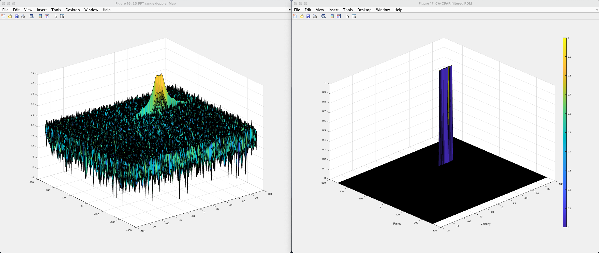

# Radar Target Generation and Detection Project

## Project Overview
The project in clustered into the following steps, as outlined on the Udacity Sensor Fusion Nanodregee course description:

- Configure the FMCW waveform based on the system requirements.
- Define the range and velocity of target and simulate its displacement.
- For the same simulation loop process the transmit and receive signal to determine the beat signal
- Perform Range FFT on the received signal to determine the Range
- Perform the CFAR processing on the output of 2nd FFT to display the target.


### System Requirements for FMCW Waveform Design

The following system level requirements for a radar design are given:

| System Requirement     | Value       |
|------------------------|-------------|
| Frequency (operating)  | 77 GHz      |
| Range Resolution       | 1 m         |
| Max Range              | 200 m       |
| Max Velocity           | ±70 m/s     |
| Velocity Resolution    | 3 m/s       |

Based on the those requirements the following FMCW waveform was designed

```matlab
% FMCW Signal Bandwidth
B_sweep = c / (2 * range_res);

% FMCW Signal Chirp Time
T_chirp = 5.5 * 2 * range_max / c;

% FMCW Signal Slope
slope = B_sweep/T_chirp;
```


### Initial Target Parameter

I have choosen the following initial target parameters:

```matlab
v_target_init = 50;     % in m/s
r_target_init = 100;    % in m
```

### Simulation of Signal Propagation

<!-- Tx and Rx Signal for all time steps konstant motion of the target with  -->

The following equations show the modeling of the signal propagation.

In the code Tx and Rx signals for all time steps, considering constant motion (velocity) of the target, are calculated and both signals are then mixed. 


```matlab
%% Signal generation and Moving Target simulation
% Running the radar scenario over the time. 

% loop over all sample steps
for i=1:length(t)         
    
    
    % *%TODO* :
    %For each time stamp update the Range of the Target for constant velocity. 

    % first loop iteration: set range to initial target range
    if i == 1
        r_t(i) = range_target_init;

    % Update range of the targt with velocity with distance driven during delta time    
    else
        r_t(i) = r_t(i-1) + v_target_init * ( t(i)-t(i-1) );
    end

    td(i) = 2 * r_t(i) / c;
    

    % *%TODO* :
    %For each time sample we need update the transmitted and
    %received signal. 
    Tx(i) = cos( 2 * pi * ( fc * t(i) + slope * t(i)^2 / 2 ) );
    Rx (i)  = cos( 2 * pi * ( fc * ( t(i) - td(i) ) + slope * ( t(i)-td(i) )^2 / 2 ) );
    
    % *%TODO* :
    %Now by mixing the Transmit and Receive generate the beat signal
    %This is done by element wise matrix multiplication of Transmit and
    %Receiver Signal
    Mix(i) = Tx(i).*Rx(i);
    
end

```


### Range FFT

```matlab
%% RANGE MEASUREMENT;

 % *%TODO* :
%reshape the vector into Nr*Nd array. Nr and Nd here would also define the size of
%Range and Doppler FFT respectively.
Mix2D = reshape(Mix, [Nr,Nd]);

 % *%TODO* :
%run the FFT on the beat signal along the range bins dimension (Nr).
signal_fft = fft(Mix2D, Nr, 1);

  % *TODO* :
% normalize and get absolute values
signal_fft = abs(signal_fft/Nr);  % 


 % *%TODO* :
% Output of FFT is double sided signal, but we are interested in only one side of the spectrum.
% Hence we throw out half of the samples.
signal_fft_p1 = signal_fft(1:Nr/2+1);

%plotting the range
figure ('Name','Range from First FFT')
subplot(2,1,1)

 % *%TODO* :
 % plot FFT output 

f = (0:(Nr/2)); % limit frequency to half of the spectrum for plotting
plot(f, signal_fft_p1);
axis ([0 200 0 0.5]);
```

As seen in the screenshot the result of the 1st FFT shows that the main frequency corresponds to 100m target range.


### 2D FFT (Range and Doppler) with 2D CFAR filter

Before running the 2D CFAR filter the output of the 2D FFT, so called Range-Doppler-Map (RDM), looks like this: 


#### Implementation steps for the 2D CFAR process

In the next step a 2D CA-CFAR filter is implemented, optimized and performed on the Range-Doppler-Map. 

The 2D CFAR sliding windows filter pattern looks like this:


```matlab
%% CFAR implementation

%Slide Window through the complete Range Doppler Map

% *%TODO* :
%Select the number of Training Cells in both the dimensions.

Tr = 8;
Td = 8;

% *%TODO* :
%Select the number of Guard Cells in both dimensions around the Cell under 
%test (CUT) for accurate estimation
Gr = 4;
Gd = 8;


% *%TODO* :
% offset the threshold by SNR value in dB
offset = 8;

% *%TODO* :
%Create a vector to store noise_level for each iteration on training cells
noise_level = zeros(1,1);


% *%TODO* :
%design a loop such that it slides the CUT across range doppler map by
%giving margins at the edges for Training and Guard Cells.
%For every iteration sum the signal level within all the training
%cells. To sum convert the value from logarithmic to linear using db2pow
%function. Average the summed values for all of the training
%cells used. After averaging convert it back to logarithimic using pow2db.
%Further add the offset to it to determine the threshold. Next, compare the
%signal under CUT with this threshold. If the CUT level > threshold assign
%it a value of 1, else equate it to 0.

% Use RDM[x,y] as the matrix from the output of 2D FFT for implementing
% CFAR

% Training and Guards Cells numbers
N_guard_cells = (2 * Gr + 1) * (2 * Gd + 1) - 1; % substract CUT
N_training_cells = (2 * Tr + 2 * Gr + 1) * (2 * Td + 2 * Gd + 1) - (N_guard_cells + 1);

% *%TODO* :
% The process above will generate a thresholded block, which is smaller 
%than the Range Doppler Map as the CUT cannot be located at the edges of
%matrix. Hence,few cells will not be thresholded. To keep the map size same
% set those values to 0. 
 
% initialize CFAR output to zero for all CUT
CFAR = zeros(size(RDM));

% looping over all CUT after subtracting the training and guard Cells with
% as margins from the matrix
for range_i = Tr + Gr + 1:Nr/2 - (Gr+Tr)
    for doppler_i = Td + Gd + 1: Nd - (Gd + Td)

        
        % init / reset per CUT vars
        num_training_cells_counted = 0;
        noise_level = 0;
        
        % Step through all training cells to and sum all values to determine the noise level
        for p = range_i - (Tr + Gr):range_i + Tr + Gr
            for q = doppler_i - (Td + Gd):doppler_i + Td + Gd
           
                   % Exclude Guard cells and CUT
                   if (abs(range_i - p) > Gr || abs(doppler_i - q) > Gd)
                       % Converrt db to power and to noise level
                       noise_level = noise_level + db2pow(RDM(p,q));
                       num_training_cells_counted = num_training_cells_counted + 1;
                   end
            end
        end

        
        % Calc the noise threshold (summed up noise of all training cell
        % divided by number of training cells
        % convert back to db
        threshold = pow2db(noise_level/N_training_cells);

        % Add offset to the threshold
        threshold = threshold + offset;

        % Get CUT values and compare against threshold
        signal = RDM(range_i, doppler_i);
        

        if  (RDM(range_i, doppler_i) > threshold)
            CFAR(range_i, doppler_i) = 1;
        end
        
    end
end


% *%TODO* :
%display the CFAR output using the Surf function like we did for Range
%Doppler Response output.
figure('Name', "CA-CFAR filtered RDM")

surf(doppler_axis,range_axis,CFAR);
colorbar;
xlabel('Velocity');
ylabel('Range');
```

#### Selection of Training, Guard cells and offset

After multiple iterations / optimization steps of the Training, Gurad Cells and offsets values the following settings produced the desired results:

```matlab
%Select the number of Training Cells in both the dimensions.
Tr = 8;
Td = 8;

%Select the number of Guard Cells in both dimensions around the Cell under 
%test (CUT) for accurate estimation
Gr = 4;
Gd = 8;

% offset the threshold by SNR value in dB
offset = 8;
```



#### Steps taken to suppress the non-thresholded cells at the edges

Therefore the the overall output (filtered RDM ```CFAR```) is first initialized with zeros. While sliding over all CUT a margin of the size of Training + Gruad Cells (depending on the dimension, either Range or Velocity) is substracted for the indices that are looped over. 